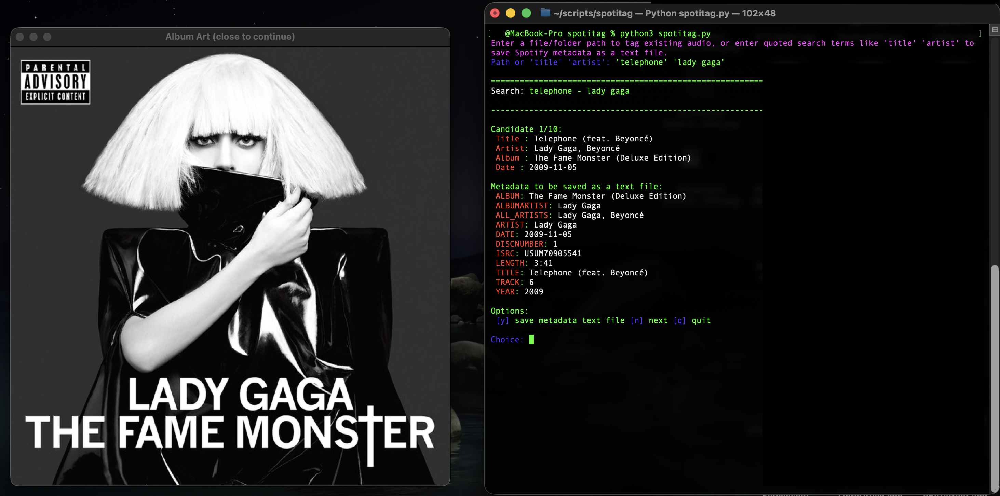

# SpotiTag

`spotitag.py` is an interactive command-line Spotify metadata helper for local music files. It searches Spotify, previews candidate track metadata, shows album art, writes clean tags to supported audio files, can rename files using Spotify metadata, and can also export Spotify metadata to a plain `.txt` file when you search by title and artist.

The script is designed for people who maintain local music libraries and want a fast way to match files against Spotify metadata without losing control over what gets written.

The script was originally designed for MacOS but should have no issues running on other systems. If not, feel free to update code to work for you.

**NOTE: `spotitag.py` uses the Spotify developer API to fetch metadata, and therefore requires an active Premium account. Directions below on setup.**

**This script does NOT download song files. It is only used for metadata.**





---

## What it does

`spotitag.py` supports two main workflows:

1. **Tag an existing audio file or folder**
   - Search Spotify using the existing filename.
   - Review candidate Spotify matches.
   - Accept, skip, go to the next result, skip the file, accept for all files, skip all, or quit.
   - Choose exactly what tags get written.
   - Optionally exclude fields such as title, artist, album, year, filename, or image.
   - Optionally skip album art.
   - Rename the file using clean Spotify metadata.

2. **Search by title and artist only**
   - Search Spotify using a title and artist name.
   - Review candidate results.
   - Save the selected Spotify metadata as a plain `.txt` file.

---

## Features

- Search Spotify for track metadata.
- Works with a single file or a folder of music files.
- Supports command-line arguments and interactive prompts.
- Tags common audio formats:
  - `.mp3`
  - `.flac`
  - `.ogg`
  - `.m4a`
- Writes the following metadata fields from Spotify:
  - Title
  - Artist
  - Album
  - Album Artist
  - Date
  - Year
  - Track Number
  - Disc Number
  - Length
  - ISRC
  - UPC
  - All Artists
- Downloads and embeds album art when available.
- Shows album art preview when supported by your system.
- Removes duplicate year/date-style fields where applicable.
- Keeps featured artists out of filenames while preserving them in metadata when appropriate.
- Preserves remix/edit/version/demo-style titles carefully.
- Lets you exclude individual fields before writing tags.
- Exports Spotify metadata to a `.txt` file when searching by title and artist.

---

## Prerequisites

### 1. Python

Install Python 3. Recommended:

```bash
python3 --version
```

### 2. Python packages

Install the required packages:

```bash
python3 -m pip install spotipy mutagen requests pillow
```

Package purpose:

| Package | Purpose |
|---|---|
| `spotipy` | Connects to the Spotify Web API |
| `mutagen` | Reads and writes audio metadata tags |
| `requests` | Downloads album art |
| `pillow` | Displays album art previews when Tkinter is available |

### 3. **(Optional)** Image preview support

Album art preview uses `tkinter` plus `Pillow` when available.

On macOS, Tkinter is often available with the system Python or Python.org installers. If image preview does not work, the tagging and metadata export features can still work.

---

## Spotify API setup

`spotitag.py` uses Spotify API credentials through environment variables:

- `SPOTIPY_CLIENT_ID`
- `SPOTIPY_CLIENT_SECRET`

These are required before running the script.

### Step 1: Create a Spotify Developer app

1. Go to the Spotify Developer Dashboard.
2. Log in with your Spotify account.
3. Create a new app.
4. Select or enable the Web API option if prompted.
5. Open the app settings.
6. Copy your **Client ID**.
7. Click to view and copy your **Client Secret**.

You do not need user playlist permissions for this script. It uses Spotify search and public track/album metadata.

### Step 2: Export your credentials in Terminal

Replace the example values with your real Spotify credentials.

#### macOS / Linux / zsh / bash

```bash
export SPOTIPY_CLIENT_ID="your_client_id_here"
export SPOTIPY_CLIENT_SECRET="your_client_secret_here"
```

Then run the script from the same terminal window:

```bash
python3 spotitag.py
```

### Step 3: Make the exports permanent

If you use zsh, which is the default shell on newer macOS versions:

```bash
echo 'export SPOTIPY_CLIENT_ID="your_client_id_here"' >> ~/.zshrc
echo 'export SPOTIPY_CLIENT_SECRET="your_client_secret_here"' >> ~/.zshrc
source ~/.zshrc
```

If you use bash:

```bash
echo 'export SPOTIPY_CLIENT_ID="your_client_id_here"' >> ~/.bashrc
echo 'export SPOTIPY_CLIENT_SECRET="your_client_secret_here"' >> ~/.bashrc
source ~/.bashrc
```

On some macOS bash setups, use `~/.bash_profile` instead:

```bash
echo 'export SPOTIPY_CLIENT_ID="your_client_id_here"' >> ~/.bash_profile
echo 'export SPOTIPY_CLIENT_SECRET="your_client_secret_here"' >> ~/.bash_profile
source ~/.bash_profile
```

### Windows PowerShell

For the current PowerShell session only:

```powershell
$env:SPOTIPY_CLIENT_ID="your_client_id_here"
$env:SPOTIPY_CLIENT_SECRET="your_client_secret_here"
```

To save them permanently for your user account:

```powershell
[Environment]::SetEnvironmentVariable("SPOTIPY_CLIENT_ID", "your_client_id_here", "User")
[Environment]::SetEnvironmentVariable("SPOTIPY_CLIENT_SECRET", "your_client_secret_here", "User")
```

Close and reopen PowerShell after setting permanent variables.

---

## Installation

Clone or download the repository, then place `spotitag.py` wherever you want to run it.

Example:

```bash
git clone https://github.com/Kappa-Kappa/SpotiTag.git
cd SpotiTag
python3 -m pip install spotipy mutagen requests pillow
```

Make sure your Spotify credentials are exported before running the script.

---

## Basic usage

There are two ways to use the script:

1. Provide arguments directly when calling the script.
2. Run the script with no arguments and enter the path or search terms when prompted.

---

## Usage mode 1: Tag an existing file or folder

### Tag a single file 


```bash
python3 spotitag.py /Path/To/Song.flac
```

Example **(Use " or ' if file name has spaces)**:

```bash
python3 spotitag.py '/Users/John/Music/Party in the USA - Miley Cyrus.flac'
```

The script will:

1. Read the file name/tags.
2. Pick the likely title and artist.
3. Search Spotify.
4. Show candidate matches.
5. Let you accept, skip, or move through results.
6. Ask what should be written.
7. Write tags and optionally rename the file.

### Tag a folder

```bash
python3 spotitag.py /Path/To/Music/Folder
```

Example **(Use " or ' if folder name has spaces)**:

```bash
python3 spotitag.py '/Users/John/Music Folder'
```


The script scans the folder for supported files:

```text
.mp3, .flac, .ogg, .m4a
```

It then processes each file interactively.

### Interactive path mode

Run the script with no arguments:

```bash
python3 spotitag.py
```

When prompted, enter a file or folder path **(Do not use " or ' , even if file/folder name has spaces, or will say file doesn't exist)**:

```text
Enter file/folder path OR search term ('title' 'artist'): /Path/To/Music/Folder
```

OR:

```text
Enter file/folder path OR search term ('title' 'artist'): /Path/To/Music/Party in the USA - Miley Cyrus.flac
```

---

## Usage mode 2: Search by title and artist, then save metadata as text

Use this mode when you do not want to tag an audio file. The script searches Spotify and saves the selected metadata to a `.txt` file.

### Search directly from the command line

**(Requires ' or ")**

```bash
python3 spotitag.py 'Song Title' 'Artist Name'
```

Example:

```bash
python3 spotitag.py 'Party in the USA' 'Miley Cyrus'
```


### Search interactively

Run:

```bash
python3 spotitag.py
```

Then enter quoted title and artist search terms **(Requires ' or ")**:

```text
Enter file/folder path OR search term ('title' 'artist'): 'Party in the USA' 'Miley Cyrus'
```

The script will show Spotify results. When you accept one, it saves a metadata `.txt` file in the current working directory.

The saved text file includes metadata only, for example:

```text
ALBUM: Example Album
ALBUMARTIST: Example Artist
ALL_ARTISTS: Example Artist
ARTIST: Example Artist
DATE: 2024-01-01
DISCNUMBER: 1
ISRC: USXXX0000000
LENGTH: 3:42
TITLE: Example Song
TRACK: 1
YEAR: 2024
SPOTIFY_URL: https://open.spotify.com/track/...
SPOTIFY_ID: ...
```

---

## Interactive controls

When reviewing a Spotify result for an audio file, you will see options like:

```text
[y] accept [n] next [x] skip-file
[a] accept-all [s] skip-all [q] quit
```

### Result selection options

| Option | Meaning |
|---|---|
| `y` | Accept this Spotify result for the current file |
| `n` | Show the next Spotify result |
| `x` | Skip the current file |
| `a` | Accept this result and continue accepting for later files where applicable |
| `s` | Skip all remaining files |
| `q` | Quit the script |

After accepting a result, you will be asked what should be written:

```text
[1] import all tags & image
[2] import tags & choose exclusions
[3] import tags but skip image
[4] go back to search results
```

### Write options

| Option | Meaning |
|---|---|
| `1` | Write all available metadata and album art |
| `2` | Choose fields to exclude before writing |
| `3` | Write metadata tags but do not embed album art |
| `4` | Go back to the search results without writing this candidate |


---

## Excluding fields

When you choose option `2`, you can exclude fields from being written.

Example:

```text
Enter exclusions (comma-separated: title, artist, album, year, filename, image, etc.): filename, image, title
```

Common exclusions:

| Exclusion | Effect |
|---|---|
| `title` | Do not overwrite the title tag |
| `artist` | Do not overwrite the artist tag |
| `album` | Do not overwrite the album tag |
| `year` | Do not overwrite year/date-style fields |
| `filename` | Do not rename the file |
| `image` | Do not embed album art |
| `track` | Do not overwrite track number |
| `discnumber` | Do not overwrite disc number |
| `isrc` | Do not write ISRC |
| `upc` | Do not write UPC |
| `length` | Do not write track length |

You can separate exclusions with commas.

---

## Filename behavior

When tagging a file, the script may suggest and apply a cleaner filename based on Spotify metadata.

The general format is:

```text
Title - Artist.ext
```

The script attempts to keep featured artists out of filenames while preserving the proper metadata inside the audio tags.

Example:

```text
Existing Filename: Telephone (feat. Beyonce) - Lady GaGa.flac
Suggested Filename: Telephone - Lady GaGa.flac
```

To prevent renaming, choose exclusions and include 'filename':

```text
Enter exclusions (comma-separated: title, artist, album, year, filename, image, etc.): filename
```

---

## Common examples

### Tag one FLAC file

```bash
python3 spotitag.py '/Users/John/Music/Telephone - Lady GaGa.flac'
```

### Tag a full folder

```bash
python3 spotitag.py /Users/John/Music
```

### Run interactively

```bash
python3 spotitag.py
```

Then enter:

```text
/Users/John/Music/MyLibrary
```

### Search by song title and artist and save metadata text

```bash
python3 spotitag.py 'Telephone' 'Lady GaGa'
```

### Search interactively by title and artist

```bash
python3 spotitag.py
```

Then enter:

```text
'Telephone' 'Lady GaGa'
```

### Tag a file but skip album art

1. Accept a result with `y`.
2. Choose option `3`.

```text
[3] import tags but skip image
```

### Tag a file but keep the existing filename

1. Accept a result with `y`.
2. Choose option `2`.
3. Enter:

```text
filename
```

### Tag a file but keep filename and skip image

1. Accept a result with `y`.
2. Choose option `2`.
3. Enter:

```text
filename, image
```

---

## Use cases

### Cleaning a local music library

Use folder mode to process a directory of files one by one and bring titles, artists, album names, dates, track numbers, and artwork in line with Spotify metadata.

### Fixing one badly tagged file

Use single-file mode when a track has missing or incorrect metadata.

### Exporting Spotify metadata without editing audio

Use title/artist mode to save a `.txt` metadata file for reference, cataloging, or manual use elsewhere.

### Avoiding unwanted filename changes

Use the `filename` exclusion whenever you want metadata tags updated but want the current file name preserved.

### Embedding Spotify album art to files

Use option `3` and exclude `title, artist, album, year, filename, track, discnumber, isrc, upc, length` if you only want embedded artwork.


---

## Troubleshooting

### `Set SPOTIPY_CLIENT_ID and SPOTIPY_CLIENT_SECRET in environment.`

Your Spotify API credentials are not currently available to the script.

Run:

```bash
export SPOTIPY_CLIENT_ID="your_client_id_here"
export SPOTIPY_CLIENT_SECRET="your_client_secret_here"
```

Then try again from the same terminal window.

### `No results found`

Try a cleaner title and artist search.

For example, instead of:

```bash
python3 spotitag.py "Song Title (Very Specific Remix Version)" "Artist feat Someone"
```

Try:

```bash
python3 spotitag.py "Song Title" "Artist"
```
### `File does not exist`

Make sure you are correctly using ' or " around file path. See **Usage Mode 1** section above.

### Album art preview does not show

The script can still tag files and save metadata. The preview window depends on optional GUI support from Tkinter and Pillow.

Install Pillow:

```bash
python3 -m pip install pillow
```

If Tkinter is unavailable, install a Python distribution that includes Tkinter or continue without preview support.

### File was renamed but I did not want it renamed

When accepting a result, choose:

```text
[2] import tags & choose exclusions
```

Then enter:

```text
filename
```

---

## Safety notes

- Back up important music files before bulk tagging.
- Test on a small folder first.
- Spotify metadata may not always match your preferred library style.
- Use exclusions when you want to preserve specific existing tags.
- Keep your Spotify Client Secret private. Do not commit it to GitHub.

---

## Suggested repository structure

```text
spotitag/
├── spotitag.py
├── README.md
└── requirements.txt
```

Optional `requirements.txt`:

```text
spotipy
mutagen
requests
pillow
```

Then users can install dependencies with:

```bash
python3 -m pip install -r requirements.txt
```

---

## Disclaimer

This tool is not affiliated with Spotify. It uses Spotify metadata through the Spotify Web API. You are responsible for complying with Spotify's Developer Terms and for keeping your API credentials secure.
